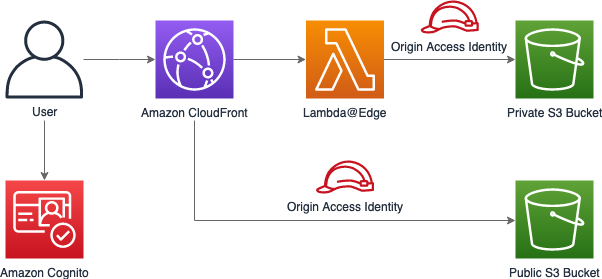
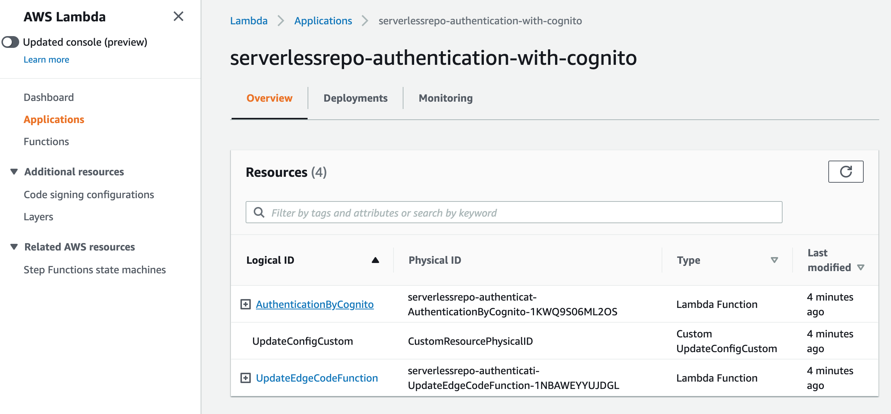
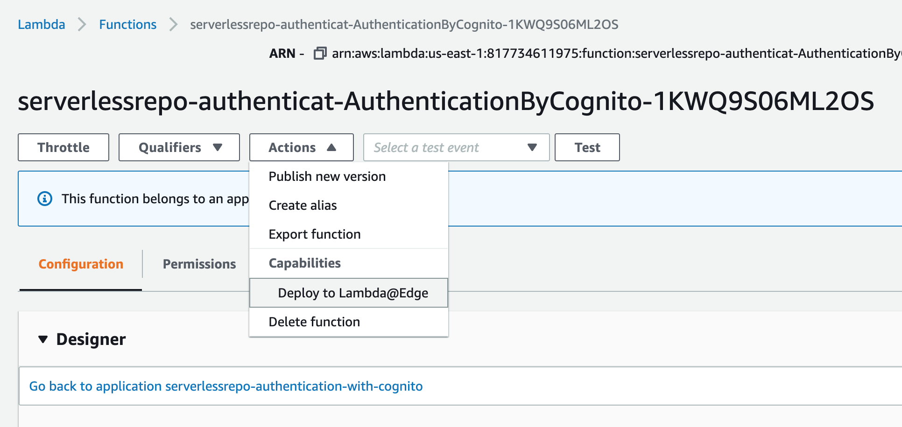
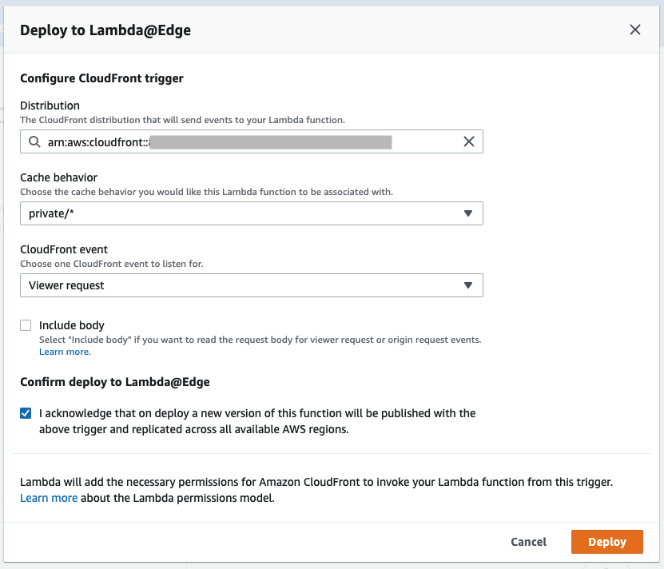
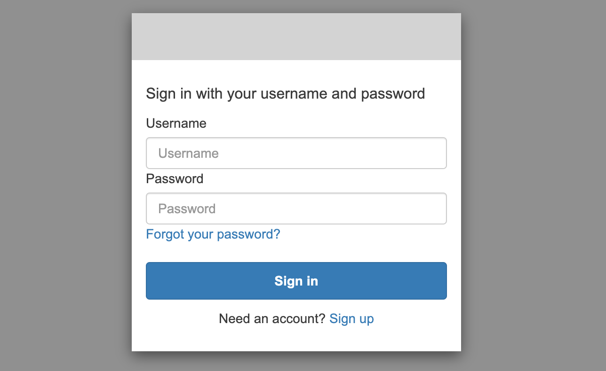
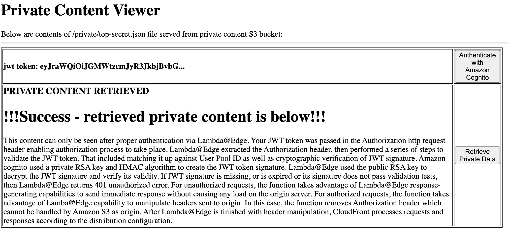

在本章中, 您将会在SAR（Serverless Application Repository）中查找并部署一个已发布的无服务器应用。此应用会在您的网站上实现Amazon Cognito鉴权功能。

如下是本实验的架构图

包含如下两个S3桶
- 私有S3桶: 包含私有内容，用户需要通过Amazon Cognito登录后才能访问此内容
- 公有S3桶: 包含本次实验的网站资源，用户无需登录即可通过CloudFront访问此资源

实现原理如下

1. 用户访问Amazon Cognito UI页面进行登录
2. 登录后，Cognito会生成一个JWT(Json Web Token)并返回一个包含JWT的跳转URL
3. 用户的浏览器解析URL中的JWT，然后向S3桶中的私有内容发送请求，同时将JWT添加到鉴权header中
4. CloudFront将请求路由到最近的AWS边缘节点。在查看者请求（viewer request）阶段，CloudFront REC（区域边缘缓存）上会触发一个Lambda@Edge函数
5. 此Lambda@Edge函数解析并校验JWT
6. 如果Lambda@Edge函数的所有校验步骤都通过，Lambda@Edge删除鉴权header，并允许此请求继续向下分发到源站服务器（即私有S3桶）
7. 私有S3桶中的私有内容将会返回给用户

{}
在实验开始前，由于网页使用了jQuery，请确认此[jQuery链接](https://code.jquery.com/jquery-3.2.1.min.js)可以正常访问
{}
 

## 通过CloudFormation部署网站

本步骤中，您将通过CloudFormation部署本实验的网站，包含一个私有S3桶、公有S3桶以及相应的前端资源

1. 点击此[链接](https://console.aws.amazon.com/cloudformation/home?region=us-east-1#/stacks/new?stackName=auth-at-edge&templateURL=https://do-not-delete-cloudfront-ext-workshop.s3.amazonaws.com/edge-auth-workshop.template)启动CloudFormation堆栈
2. 使用默认选项点击下一步，勾选全部**我确认**复选框后点击**创建堆栈**按钮.
3. 等待部署完成
4. 您可以在CloudFormation Console中查看部署进展。进入[CloudFormation console](https://console.aws.amazon.com/cloudformation/home?region=us-east-1#)并选择名字为**auth-at-edge**的堆栈
5. 点击**输出**标签页，可以看到所有已创建的资源，找到**CloudFrontDistribution**、**CognitoUserPoolId**和**DemoUrl**，您将会在后续步骤中使用到它们

## 通过SAR部署鉴权校验应用

本步骤中，您将通过SAR(Serverless Application Repository)部署一个Lambda函数到您的账号

1. 打开[AWS SAR(Serverless Application Repository)页面](https://serverlessrepo.aws.amazon.com/applications)
2. 勾选搜索栏下方的**Show apps that create custom IAM roles or resource policies**复选框
3. 在搜索栏中输入**authentication-with-cognito**并搜索，点击应用链接进入应用详情页面，点击**Deploy**按钮
   > 您可通过搜索关键字**aws-cloudfront-extensions**找到所有CloudFront extensions
4. 在应用详情页面中，粘贴上一步CloudFormation堆栈的Cognito User Pool Id，勾选**I acknowledge that this app creates custom IAM roles**
5. 点击**Deploy**按钮。等待直到部署成功，部署完成后会自动跳转到无服务器应用页面
6. 选择**AuthenticationByCognito**进入Lambda页面，下一步您将会配置此Lambda函数
   

## 配置CloudFront作为Lambda的触发器

本步骤中，您将为上一步部署完成的Lambda配置触发器

1. 点击右上角**操作**菜单并选择**部署到Lambda@Edge**
   
2. 在**部署到Lambda@Edge**页面中，输入如下内容：
   - 分配
     上面步骤中通过CloudFormation堆栈创建的CloudFront分配
   - 缓存行为
     选择**private/***
   - CloudFront事件
     在下拉框中，选择 **查看者请求**
   点击**部署**按钮
   
4. 等待Lambda函数部署完成
5. 您可打开[CloudFront Console](https://console.aws.amazon.com/cloudfront/)查看部署进展

## 测试

1. 在浏览器中打开上面步骤中CloudFormation堆栈输出的DemoUrl
2. 点击**Retrieve Private Data**按钮，由于用户没有登录，下图中的对话框将会弹出
   
3. 为了访问私有内容，您需要先进行登录。点击**Authenticate with Amazon Cognito**按钮，您将会跳转到Amazon Cognito Custom UI页面
   
4. 如果您之前有注册过用户，可输入用户名和密码登录。否则需要点击Sign up链接注册新用户。
   点击Sign up并按照提示输入用户名、密码以及通过邮箱获取验证码。当注册/登录成功后，浏览器将会返回实验网站并携带您的JWT
5. 再次点击**Retrieve Private Data**按钮，登录后私有内容就可以成功显示出来了
   

